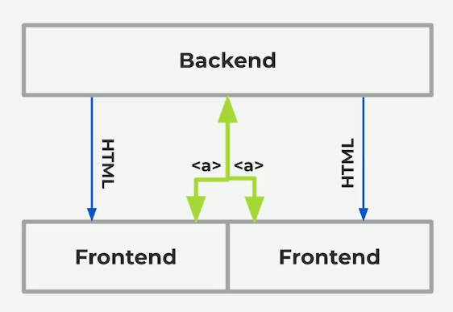
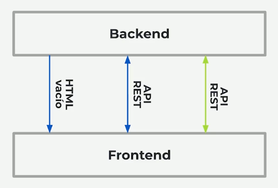
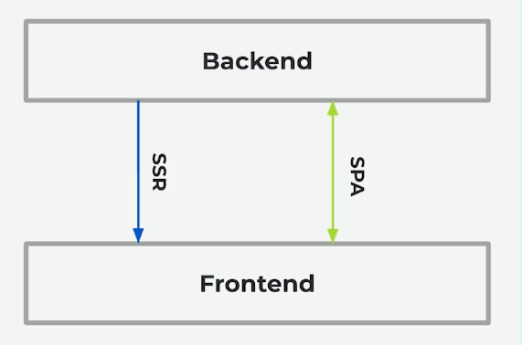

# React Router

# 1. Fundamentos de navegación en la Web

## 1.1 Cuándo necesitas React Router?

- Cuando queremos mejorar la manera de compartir
- Cuando queremos separación de resoponsabilidades
- Cuando queremos usar menos portales o condicionales manuales en la UI

## 1.2 SSR vs SPA

- Server Side Rendering - SSR
  

- Single Page Application | SPA

  - Client Side Rendering | CSR
  - Client Side Routing | CSR

  

- Progressive Server Side Rendering | PSSR = SSR = SPA
  

## 1.3 Versiones de React Router: ¿Por qué son tantas? ¿Cuál elegir?

.,....

# 2. Introducción a react router DOM 6

# 3. Fake Authentication con react router DOM 6
